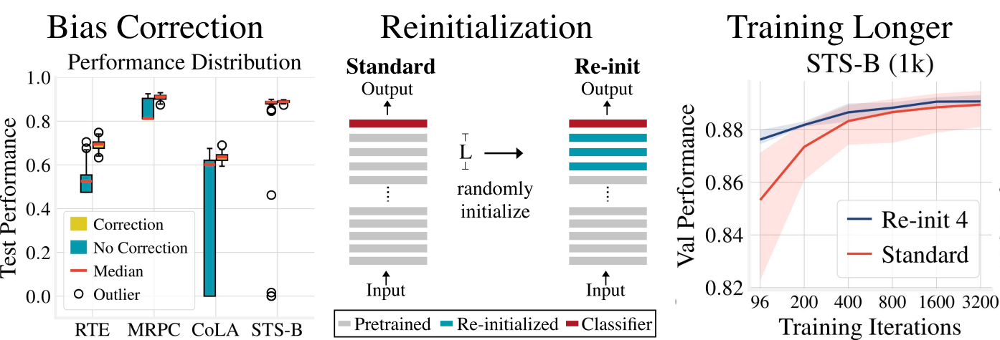

# Revisiting Few-sample BERT Fine-tuning 
[](#python)
[](https://opensource.org/licenses/MIT) 

[Paper Link](https://arxiv.org/abs/2006.05987)

#### Authors:
* [Tianyi Zhang](https://tiiiger.github.io)*
* [Felix Wu](https://sites.google.com/view/felixwu/home)*
* [Arzoo Katiyar](https://sites.google.com/site/arzook99/home)
* [Kilian Q. Weinberger](http://kilian.cs.cornell.edu/index.html)
* [Yoav Artzi](https://yoavartzi.com/)

*: Equal Contribution

## Overview



In this paper, we study the problem of few-sample BERT fine-tuning and identify three sub-optimal practices.
First, we observe that the omission of the gradient bias correction in the BERTAdam makes fine-tuning unstable. 
We also find that the top layers of BERT provide a detrimental initialization and simply re-initializing these layers improves convergence and performance. 
Finally, we observe that commonly used recipes often do not allocate sufficient time for training.

If you find this repo useful, please cite:
```
@article{revisit-bert-finetuning,
  title={Revisiting Few-sample BERT Fine-tuning},
  author={Zhang, Tianyi and Wu, Felix and Katiyar, Arzoo and Weinberger, Kilian Q. and Artzi, Yoav.},
  journal={arXiv preprint arXiv:2006.05987},
  year={2019}
}
```

## Requirements
```
torch==1.4.0
transformers==2.8.0
apex==0.1
tqdm
tensorboardX
```
Please install apex following the instructions at [https://github.com/NVIDIA/apex](https://github.com/NVIDIA/apex).

## Usage
We provide the following sample scripts. When using these scripts, please change `--data_dir`, `--output_dir` and `--cache_dir` to the your path to data folder, output folder, and `transformers` cache directory.

1. To train BERT baseline (with debiased Adam):
```sh
bash sample_commands/debiased_adam_baseline.sh
```
2. To use Re-init:
```sh
bash sample_commands/reinit.sh
```
3. To train the model with more iterations
```sh
bash sample_commands/debiased_adam_longer.sh
```
4. To use mixout:
```sh
bash sample_commands/mixout.sh
```
5. To use layer-wise learning rate decay:
```sh
bash sample_commands/llrd.sh
```
6. To use pretrained weight decay:
```sh
bash sample_commands/pretrained_wd.sh 
```

### Input
You need to download [GLUE](https://gluebenchmark.com/) dataset by this [script](https://gist.github.com/W4ngatang/60c2bdb54d156a41194446737ce03e2e).
Feed the path to your data through `--data_dir`.

### Commands
We provide example commands to replicate our experiments in `sample_commands`.

`run_glue.py` contains the main program to fine-tuning and evaluate models.
`python run_glue.py --help` shows all available options.

Some key options are:

```
# These two replicate our experiments of bias cortrection
--use_bertadam        No bias correction # this replicates the behavior of BERTAdam
--use_torch_adamw     Use pytorch adamw # this replicates the behavior of debiased Adam 
# These two two replicate our experiments of Re-init
--reinit_pooler       reinitialize the pooler
--reinit_layers       re-initialize the last N Transformer blocks. reinit_pooler must be turned on.
```

### Output

A standard output folder generated by `run_glue.py` will look like:
```
├── raw_log.txt
├── test_best_log.txt
├── test_last_log.txt
└── training_args.bin
```
`*_log.txt` are csv files that record relevant training and evaluate results.
`test_best_log.txt` records the test performance with the best model checkpoint during training.
`test_last_log.txt` records that with the last model checkpoint. 
`training_args.bin` contains all arguments used to run a job.
